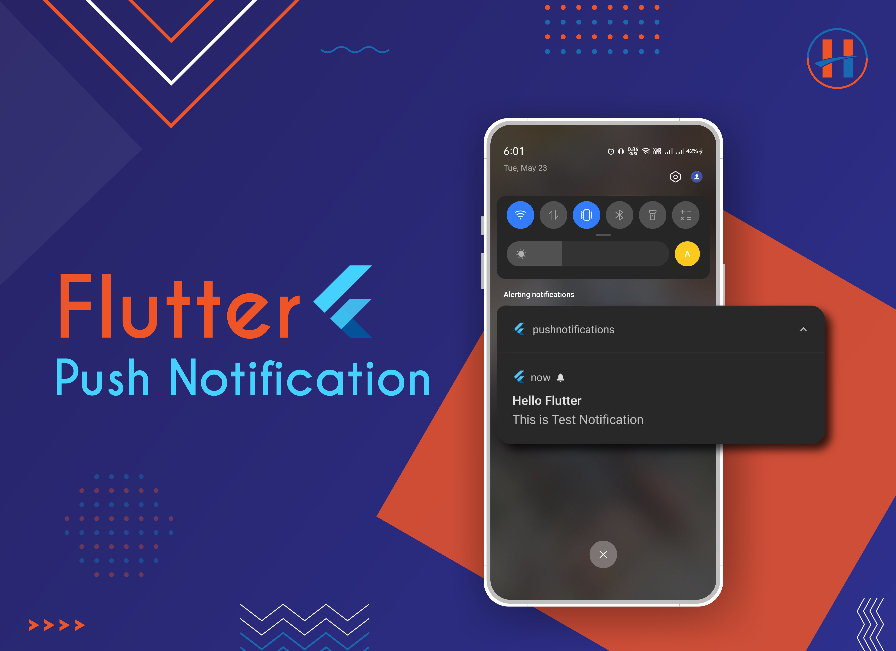

# Flutter Notification 
A demo Flutter application for Firebase Cloud Messaging (Firebase push notification)



How to implement firebase in you project:
1. Create flutter project

2. Create project in firebase console.

3. Complete Firebase project setup for both **Android** & **iOS** platforms by going to the [Firebase console](https://console.firebase.google.com/).

4. For Android, replace your google-services.json file with an existing file.

   ```bash
   android -> app -> google-services.json
   ```

5. For running on **iOS**, you have to do some configurations from Xcode. Follow the guide [here](https://firebase.flutter.dev/docs/messaging/apple-integration).

   1. In `pubspec.yaml`

      add,
      ```dev_dependencies:
         flutter_test:
           sdk: flutter
         firebase_messaging: ^14.6.1
         flutter_local_notifications: ^14.1.0
         firebase_core: ^2.13.0
       ```

6. In src/main/manifest,

   Inside `<activity/>` tag (below existing intent filter tag)

   add,
     ```
      <activity        
         <intent-filter>
             <action android:name="FLUTTER_NOTIFICATION_CLICK" />
             <category android:name="android.intent.category.DEFAULT" />
          </intent-filter>
      </activity>
   
      <application   
         <meta-data
            android:name="com.google.firebase.messaging.default_notification_channel_id"
            android:value="high_importance_channel" />

        <meta-data
            android:name="com.google.firebase.messaging.default_notification_icon"
            android:resource="@mipmap/ic_launcher" />

        <meta-data
            android:name="com.google.firebase.messaging.default_notification_color"
            android:resource="@color/notification_color" />   
   
      </application>
     ```

7. In `app/build.gradle`

   add,
   `apply plugin: 'com.google.gms.google-services'` add this at the bottom

8. In `android/build.gradle`

   add,
    ```dependencies {
        classpath 'com.google.gms:google-services:4.3.8'
     ```
9. enjoy.

For more help Read official documentation [Here](https://pub.dev/packages/firebase_messaging)